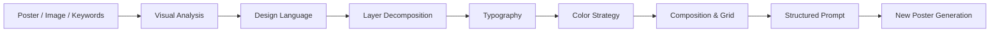

<div align="center">

# 🎨 Poster Prompt Generator

### Reverse-engineer poster design language into reproducible AI prompts.

**Don't just describe what's in a poster.  
Describe the design decisions behind it.**

<br/>


<br/>

**中文** · English coming soon

</div>

---

## ✦ What is Poster Prompt Generator?

Most image captioning systems answer:

> **What is in this image?**

Poster Prompt Generator tries to answer a different question:

> **How was this visual designed?**

它不是简单地把一张海报描述成：

```text
一个女孩站在中间，背景是蓝色，
周围有一些文字和贴纸。
```

而是尝试从设计师视角反推：

```text
为什么主体位于这里？
为什么标题使用这种字号？
为什么人物与文字产生遮挡？
为什么看似杂乱的贴纸仍然具有视觉秩序？
背景究竟由多少层素材组成？
字体、配色、网格和构图之间是什么关系？
```

最终将海报转化为一段能够被生成模型理解和复现的设计语言。

<br/>

<div align="center">

### Poster → Visual Grammar → Design System → Prompt

</div>

---

## ✨ Why this project?

当前很多 AI 图像 Prompt 更关注：

- 人物是谁
- 场景在哪里
- 穿什么衣服
- 什么摄影风格
- 什么光线

但对于 **Poster Design** 来说，这些信息还不够。

真正影响海报视觉质量的往往是：

**Layout / Grid / Typography / Hierarchy / Layering / Occlusion / Color Strategy / Visual Rhythm**

因此，我尝试建立一套面向生成式设计的视觉反编译方法。

目标不是：

> 让 AI 看懂海报里有什么。

而是：

> **让 AI 理解这张海报为什么这样设计。**

---

# 🧠 Core Workflow



核心流程可以概括为：

```text
INPUT
↓
识别整体视觉语言
↓
判断版面率
↓
分析构图
↓
推断网格系统
↓
拆解图层结构
↓
分析主体
↓
重建文字层级
↓
判断字体性格
↓
分析配色逻辑
↓
识别装饰元素
↓
描述遮挡与空间关系
↓
生成完整 Poster Prompt
```

---

# 🔬 Poster Reverse Engineering

## 01 — Design Language

首先判断海报整体属于什么视觉语言。

例如：

```text
Y2K
手账拼贴
复古报刊
学院构成主义
瑞士国际主义
孟菲斯
拼贴
波普
扁平设计
C4D
复古
国潮
像素
故障艺术
弥散
酸性设计
极简主义
```

这一阶段不是简单贴一个 Style Tag。

真正需要分析的是：

```text
视觉语言
+
材质语言
+
排版语言
+
时代感
+
印刷 / 数码特征
```

例如：

```text
复古报刊剪贴
```

需要进一步转化为：

```text
旧报纸纹理、粗糙油墨颗粒、黑白照片、
不规则裁切、手撕纸边缘、错位文字、
高密度信息排版与模拟印刷套色。
```

---

# 📐 02 — Layout Density

海报首先可以从版面率判断整体视觉密度。

### High-density Layout

特点：

```text
留白少
元素密集
图像与文字大量叠加
视觉节奏快
信息量大
```

常见于：

```text
促销
潮流
活动
新品
娱乐
青年文化
```

Prompt Keywords：

```text
high-density layout
packed composition
layered collage
overlapping typography
rich visual information
```

---

### Low-density Layout

特点：

```text
留白多
视觉焦点集中
信息数量少
元素间距大
整体克制
```

常见于：

```text
时尚
艺术
展览
品牌
产品
高级感设计
```

Prompt Keywords：

```text
large negative space
restrained composition
minimal visual hierarchy
editorial layout
quiet visual rhythm
```

---

# 🧭 03 — Composition

系统进一步判断海报使用哪一种构图策略。

| Composition | Visual Logic |
|---|---|
| 上下构图 | 主视觉与阅读信息形成上下空间 |
| 左右构图 | 主视觉与信息形成横向平衡 |
| 中心构图 | 核心主体集中于视觉中心 |
| 对角线构图 | 利用方向制造运动与张力 |
| 四角构图 | 信息锚定边缘，中间突出主体 |
| 曲线 / S 构图 | 元素沿视觉路径产生流动 |
| 散点构图 | 多个视觉节点形成自由节奏 |
| 包围式构图 | 图片、文字、装饰覆盖整个版面 |

重要原则：

> **Scatter ≠ Random**

散点构图看起来可能很自由，但元素大小、位置、间距与视觉重量通常仍然存在规律。

---

# ▦ 04 — Grid System

漂亮的海报并不意味着没有网格。

即使是实验性排版，背后也可能隐藏着严格的 Grid。

主要分析：

```text
通栏网格
分栏网格
模块网格
基线网格
层级网格
```

Prompt 不应该只是：

```text
把标题放左边
```

而应该尽量变成：

```text
使用偏左的模块化网格组织信息，
主标题横跨两个栏位，
辅助信息沿基线纵向排列，
右侧保留大面积负空间。
```

---

# 🧱 05 — Layer Decomposition

这是整个方法最重要的一步之一。

把海报想象成一个 Photoshop 文件。

```text
Layer 01 — Background Color
Layer 02 — Texture
Layer 03 — Background Image
Layer 04 — Background Typography
Layer 05 — Main Subject
Layer 06 — Subject Outline
Layer 07 — Main Title
Layer 08 — Secondary Typography
Layer 09 — Stickers / Decorations
Layer 10 — Noise / Grain / Print Effect
```

重点分析三件事：

### Material

```text
纸张
报纸
金属
塑料
天空
海浪
胶片
渐变
网格
扫描纹理
油墨颗粒
```

### Edge Treatment

```text
手撕边缘
剪贴硬边
白色贴纸描边
扫描毛边
粗糙纸张边缘
羽化
```

### Occlusion

重点描述：

```text
谁在谁前面？
谁被谁遮挡？
标题是否穿过人物？
贴纸是否压住照片？
人物是否覆盖背景文字？
```

例如：

```text
主标题部分位于人物背后，
另一部分覆盖人物肩膀，
形成二维文字与人物摄影之间的空间穿插。
```

这类信息通常比单纯的 Style Keyword 更能提升海报生成效果。

---

# 👤 06 — Main Subject

存在人物或主体时，需要进一步分析：

```text
主体位置
主体占比
朝向
动作
摄影角度
裁切范围
抠图方式
边缘处理
人物与文字关系
人物与装饰关系
色彩处理
```

普通描述：

```text
一个女孩站在中间。
```

设计描述：

```text
主视觉人物位于画面中轴略偏右，
占据约 60% 画幅，
采用半身摄影抠图，
人物外轮廓增加不规则白色贴纸描边，
与背景形成明显的纸张拼贴层级。
```

---

# 🔤 07 — Typography as Graphic

在海报中：

> **Typography is not just text. Typography is image.**

首先拆分信息层级：

```text
Main Title
Subtitle
Body Copy
Supporting Information
```

通常控制在少量清晰层级内，避免所有文字拥有相同视觉重量。

然后进一步判断字体的视觉性格。

---

## Typography Personality

### 轻 · Light

```text
细字重
较大负空间
现代
轻盈
```

适合：

```text
时尚 / 旅行 / 文艺
```

### 重 · Heavy

```text
宽字面
粗字重
小负空间
强视觉重量
```

适合：

```text
运动 / 促销 / 强视觉
```

### 动 · Dynamic

```text
字体倾斜
字高较高
方向感明显
```

适合：

```text
潮流 / 活动 / 娱乐
```

### 文 · Editorial

```text
细字重
笔画舒展
负空间充足
```

适合：

```text
旅行 / 家居 / 文艺
```

### 刚 · Hard

```text
直线笔画
极粗字重
强速度感
```

适合：

```text
运动 / 游戏 / 科技
```

还可以继续根据：

```text
软 / 古 / 今 / 简 / 繁 / 矮 / 高 / 严
```

判断字体气质。

---

# 🎨 08 — Color Strategy

颜色分析不是简单输出：

```text
blue + red
```

而是分析颜色为什么这样组合。

主要判断：

### Monochrome

单一色相，通过：

```text
明度
饱和度
灰度
```

产生视觉层次。

### Analogous

使用相邻色形成：

```text
统一
柔和
协调
```

### Complementary

利用互补色产生：

```text
高对比
力量
活力
视觉冲击
```

### Duotone

利用双色半色调、套印与高反差处理形成：

```text
印刷感
实验性
视觉强化
```

进一步描述：

```text
主色
辅助色
强调色
背景色
文字色
颜色面积比例
```

例如：

```text
以高饱和钴蓝作为大面积背景主色，
荧光橙仅用于标题与贴纸强调，
蓝橙形成明显互补关系，
白色承担信息缓冲与视觉呼吸。
```

---

# ✂️ 09 — Decorative Elements

很多海报真正的“味道”来自小元素。

例如：

```text
贴纸
星星
箭头
CD
相机
冰淇淋
胶片
条形码
印章
日期
编号
Emoji
手绘涂鸦
坐标
英文小字
```

不仅识别它们是什么，还需要描述：

```text
出现位置
大小
旋转角度
前后关系
分布密度
是否与主体遮挡
是否承担视觉平衡
```

---

# 🧬 Prompt Anatomy

最终 Prompt 按下面的设计逻辑组织：

```text
[STYLE]
整体是什么视觉语言？

[BACKGROUND]
背景由哪些素材与图层构成？

[SUBJECT]
主体在哪里？多大？怎么处理？

[TYPOGRAPHY]
主标题、副标题、正文如何组织？

[DECORATION]
有哪些贴纸和视觉符号？

[COMPOSITION]
采用什么构图？

[GRID]
隐藏的网格系统是什么？

[LAYERS]
元素之间如何叠加、遮挡？

[COLOR]
颜色之间是什么设计关系？

[MOOD]
最终给人的情绪是什么？
```

最终再把这些结构重新组合成：

> **一段自然、连续、具有设计师视角的 Prompt。**

---

# ⚙️ Output Rules

Poster Prompt Generator 的输出遵循：

```text
✓ 使用具象的视觉语言
✓ 明确元素空间位置
✓ 描述图层前后关系
✓ 描述遮挡关系
✓ 描述真实平面设计操作
✓ 明确字体性格
✓ 明确字号与信息层级
✓ 明确配色逻辑
✓ 明确构图策略
✓ 描述整体视觉情绪
```

避免：

```text
✗ 很漂亮
✗ 很高级
✗ 很有设计感
✗ 好看的字体
✗ 丰富的元素
```

而应转换为：

```text
大面积负空间
极细无衬线字体
四栏模块网格
高反差双色套印
不规则纸张剪贴边缘
人物与标题前后穿插
```

另外：

```text
风格词不使用双引号强调
海报中真实出现的标题内容使用 " " 标注
最终 Prompt 汇总为一个完整自然段
```

---

# ✨ Example

## Input

```text
夏日 / 海边 / 年轻女孩 / 活泼 / Y2K
```

## Normal Caption

```text
一个年轻女孩站在海边，
周围有很多夏天元素和文字。
```

## Poster Prompt Generator

```text
整体采用青春感强烈的 Y2K 夏日手账拼贴海报风格，高版面率散点式布局，背景以高饱和天空蓝作为基础色层，上方叠加轻微胶片颗粒与扫描质感，中层加入海浪照片、手撕白纸和半透明网格形成多层纸张拼贴结构；主视觉女孩位于画面中心偏右，占据约二分之一版面，采用半身摄影抠图并增加不规则白色贴纸描边，人物略微前倾，墨镜区域加入亮色贴纸形成俏皮遮挡；主标题 "SUMMER TIME" 使用超粗无衬线黑体置于左上至画面中央区域，文字略微倾斜并与人物产生前后穿插关系，副标题和日期信息采用细体英文沿边缘错位排列，通过粗细字体形成明显信息层级；画面散布冰淇淋、相机、太阳、海星、CD、手绘箭头和小型英文贴纸，部分元素位于人物前景，部分压在背景照片之间，形成类似实体手账的多层贴纸关系；整体采用中心构图结合散点构图，以蓝色、白色作为主体色，荧光橙和柠檬黄作为高饱和强调色，制造强烈夏日阳光感，整体气质活泼、青春、调皮、清凉，带明显 DIY 手工拼贴与千禧年数码杂志气质。
```

The difference:

```text
Caption
↓
What is in the image?

Poster Prompt Generator
↓
How is the image designed?
```

---

# 🔄 Generation Modes

## Mode 01 — Poster Reverse Engineering

输入：

```text
Existing Poster
```

输出：

```text
Reproducible Design Prompt
```

用于分析已有海报的：

```text
风格
图层
主体
字体
装饰
构图
网格
颜色
情绪
```

---

## Mode 02 — New Poster Generation

输入：

```text
主题
+
主体
+
场景
+
情绪
+
关键词
```

例如：

```text
咖啡新品
东京
夜晚
年轻人
复古
```

系统匹配：

```text
Style
↓
Layout Density
↓
Composition
↓
Typography
↓
Color
↓
Layer Structure
```

再生成全新的 Poster Prompt。

重点不是复制参考海报。

而是：

> **Transfer the design rules.**

---

## Mode 03 — Image → Poster

如果输入的是普通图片而不是海报：

```text
Image
↓
Visual Caption
↓
Subject Extraction
↓
Poster Design System
↓
Poster Prompt
```

先提取：

```text
人物
场景
动作
环境
摄影语言
光线
颜色
```

再将图片内容重新组织进入海报设计系统。

---

# 🧠 The Main Idea

传统 Image Caption：

```text
What is in this image?
```

Poster Prompt Generator：

```text
How was this visual designed?
```

传统 Prompt Engineering：

```text
What should AI draw?
```

Poster Prompt Generator：

```text
How should AI organize the visual system?
```

---

# 📁 Suggested Project Structure

```text
poster-prompt-generator/
│
├── README.md
├── LICENSE
│
├── assets/
│   ├── cover.png
│   ├── workflow.png
│   └── examples/
│
├── examples/
│   ├── y2k.md
│   ├── collage.md
│   ├── editorial.md
│   └── minimal.md
│
├── prompts/
│   ├── system-prompt.md
│   └── prompt-template.md
│
└── docs/
    └── methodology.md
```

---

# 🚀 Roadmap

- [ ] Poster layout detection
- [ ] Automatic grid recognition
- [ ] Typography personality classification
- [ ] Color strategy recognition
- [ ] Poster → structured JSON
- [ ] Poster → reusable design tokens
- [ ] Poster → Figma layout
- [ ] Poster → GPT Image prompt
- [ ] Poster → Midjourney prompt
- [ ] Poster → Stable Diffusion prompt
- [ ] Poster style retrieval database
- [ ] Design language embedding
- [ ] Prompt similarity evaluation
- [ ] Before / After visual benchmark
- [ ] Open-source poster prompt dataset

---

# 💡 Future Vision

```text
Any Poster
    ↓
Visual Grammar
    ↓
Design System
    ↓
Reusable Prompt
    ↓
Infinite Variations
```

AI 已经越来越擅长理解：

> 图片里有什么。

下一步我更感兴趣的是：

> **AI 能不能理解，为什么这样设计会更好看？**

---

# 🤝 Contributing

如果你也在研究：

```text
AI Design
Prompt Engineering
Graphic Design
Generative Poster
Visual Understanding
Design Agents
Multimodal AI
```

欢迎：

**Star ⭐ · Fork · Issue · Pull Request**

也欢迎提交不同视觉风格的海报分析案例。

---

# 📄 License

See [LICENSE](LICENSE).

---

<div align="center">

## ⭐ Star this project if you find it useful

**Teaching AI to read posters like a designer.**

<br/>

### Don't describe the poster.  
### Describe the design decisions behind it.

</div>